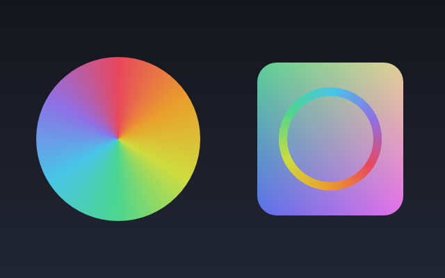

# suren

A 2D vector graphics library in Go with two independent renderers — a pure-Go CPU
rasterizer and a WebGPU compute backend — held to a measured, budgeted tolerance
contract.

[](go.mod)
[](LICENSE)



<sub>[`examples/07-conic-mesh`](examples/07-conic-mesh) — a conic (angular) gradient,
a Gouraud triangle mesh, and a conic-painted stroke. Rendered by the CPU backend;
the GPU renders it to **Δ=1**, the same 8-bit floor linear and radial sit at. The
wheel has no visible seam because its last stop returns to its first — which is a
[correctness rule, not a style choice](#correctness).</sub>

## What makes this different

Not that it renders. That two independently written implementations — an f64 CPU
rasterizer and an f32 WebGPU compute shader — are held to each other as the
**primary correctness gate**, and that the tolerance between them is a measured
quantity with a stated owner rather than a knob someone turned until the tests
went green.

**The apparatus is the product:**

- **A tolerance contract that the code enforces.** Δ=0 where both backends run the
  same analytic path. Δ≤1 as the 8-bit quantization floor between an f64 and an f32
  pipeline. Anything above that is a named budget whose reason must identify the
  operation — `Config.Validate` rejects an empty `Why`.
- **A differential fuzzer** with automatic shrinking, first-diverging-node bisect,
  and seed replay. Finds are stored as JSON specs, never seeds.
- **Property laws** checked on generated scenes, each carrying its own gate.
- **A named scene corpus** — 43 entries, each at the tolerance it *earned by
  measurement*.
- **Per-backend reconciliation** that runs the corpus on every backend the host
  exposes and **logs the ones it could not**.
- **Independent oracles** that hand-compute what a feature means, because parity
  and goldens are both blind to a bug the two renderers share.

That last one is not theoretical. The differential caught a bug in the **CPU
reference** — the f64 backend was wrong, the f32 GPU was right, more precision made
it *worse*, and a golden would have recorded the bug as expected output forever.
[The story](docs/correctness.md#1-the-mesh-crack--the-reference-was-the-buggy-one)
is the best argument here for why parity beats goldens.

→ **[docs/correctness.md](docs/correctness.md)** is the document worth your time.

## Status

Honest and specific, because the numbers below mean nothing without it.

**Parity is verified on Metal (Apple silicon) only.** The reconciliation harness runs
the corpus on every backend the host exposes; this host exposes exactly one adapter
(`metal/integrated-gpu Apple M4`). Vulkan, DX12 and GL enumerate zero. The
Vulkan/DX12 reconciliation harness exists and **has never run**. A green test run
says so out loud rather than passing quietly:

```
reconciled 1 backend(s): [metal]
NOT reconciled here (host does not expose them): [vulkan dx12] — the portability claim covers [metal] only
```

If a non-Metal backend does diverge past the floor, the first suspects are named:
FMA contraction (WGSL cannot forbid it, and f32 has the headroom to show it) and the
`routeCol` tile-backdrop summation order.

**Windowed present goes through a readback bridge** (Phase 6a). Every frame does
GPU → CPU → GPU. Native surface present (Phase 6b) is **not done** — no `present.go`
exists. The window path is validated headlessly; the display itself is on-device only.

**No CI.** There is no workflow in this repo, so there is no badge claiming one.
`go test ./...` is the gate, run by hand.

Not implemented: patterns/images, group opacity/masks, an sRGB-vs-linear toggle.
See [Features](#features).

## Quick start

Render a scene to PNG. This program compiles and runs as-is:

```go
package main

import (
	"log"
	"os"

	"github.com/stohirov/suren/backend/png"
	"github.com/stohirov/suren/geom"
	"github.com/stohirov/suren/paint"
	"github.com/stohirov/suren/path"
	"github.com/stohirov/suren/render"
)

func main() {
	c := render.NewCanvas()

	c.Fill(path.Rect(geom.RectXYWH(0, 0, 400, 300)), paint.LinearGradient{
		P0: geom.Pt(0, 0), P1: geom.Pt(0, 300),
		Stops: []paint.Stop{
			{Offset: 0, Color: paint.FromRGBA8(24, 26, 32, 255)},
			{Offset: 1, Color: paint.FromRGBA8(40, 80, 140, 255)},
		},
	}, paint.NonZero)

	c.Save()
	c.Translate(200, 150)
	c.Rotate(0.3)
	c.FillColor(path.Rect(geom.RectXYWH(-60, -60, 120, 120)), paint.RGBA(1, 1, 1, 0.85))
	c.Restore()

	c.StrokeColor(path.Circle(geom.Pt(200, 150), 100), paint.FromRGBA8(230, 160, 40, 255),
		paint.Stroke{Width: 8, Join: path.RoundJoin, Dashes: []float64{20, 12}})

	f, err := os.Create("out.png")
	if err != nil {
		log.Fatal(err)
	}
	defer f.Close()
	if err := png.Encode(f, c.Scene(), 400, 300); err != nil {
		log.Fatal(err)
	}
}
```

```sh
go get github.com/stohirov/suren
go run .
```

**Your `go.sum` will be empty.** That is the point of the next section, and it is
verified rather than claimed — the program above was built in a fresh module against
the real package, and it pulls in zero third-party code.

To render the same scene on the GPU instead, swap `png.Encode` for
`gpu.NewRenderer(400, 300)` → `Render(c.Scene())` → `Sync()` → `ReadRGBA()`. That is
a separate module and an explicit `go get`.

### Examples

`cd examples/<dir> && go run .`

| | |
|---|---|
| [`01-outline`](examples/01-outline) | Paths and outlines |
| [`02-fill`](examples/02-fill) | Fills and fill rules |
| [`03-stroke`](examples/03-stroke) | Stroke joins and caps |
| [`04-dash`](examples/04-dash) | Dash patterns and phase |
| [`05-scene`](examples/05-scene) | A composed scene: transforms, translucency, strokes → PNG + SVG |
| [`06-gradient`](examples/06-gradient) | Linear and radial gradients, a gradient-painted stroke → PNG + SVG |
| [`07-conic-mesh`](examples/07-conic-mesh) | Conic + mesh gradients → **PNG only**, and the reason is [Phase 24](docs/roadmap.md): the SVG backend would silently drop every shape in it |

## Architecture

Everything hangs off one seam, in `render/render.go`:

```go
type Renderer interface {
	Render(*scene.Scene) error
}
```

`scene.Scene` is **retained** — a whole frame of geometry before anything is drawn.
That is what makes a second backend possible: a GPU pipeline wants the whole frame
to batch, and an immediate-mode API would have to guess. `Canvas` builds one and
flattens its CTM/clip/blend state into each node, so a renderer never walks a state
stack.

### The zero-dep core, and why the cgo dep is quarantined

Three modules:

```
github.com/stohirov/suren                  geom path paint raster scene render
                                           backend/cpu  backend/png  backend/svg
                                           ── pure Go, standard library only ──

github.com/stohirov/suren/backend/gpu      own go.mod; cgo → cogentcore/webgpu → wgpu-native
github.com/stohirov/suren/backend/window   own go.mod; cgo → Ebiten
```

**A user who only wants CPU rendering pulls zero dependencies.** No cgo, no C
toolchain, cross-compiles anywhere Go does, empty `go.sum`. That is not an aesthetic
preference — it is the reason the module boundary exists, and it holds because the
core is a *separate module that does not require* the cgo one. Dependencies point
inward only; nothing in the core imports `backend/gpu`. Everything in
[NOTICE](NOTICE) is reachable only through the two quarantined modules.

### The pipeline, in two sentences

The encoder flattens a scene into flat GPU buffers — segments, per-node records,
gradient/mesh stops, clips — and bins them into **16×16 tiles**, where each tile gets
a node list, a per-(tile,node) segment list, and a scalar **backdrop** collapsing the
winding it inherits from everything to its left. One compute invocation then owns a
16-wide span of one scanline with private cover/area arrays — no global scratch, no
float atomics — which is what turns a 720-thread row-serial design into ~57,600
threads, and the backdrop is what makes plain bbox binning correct rather than merely
fast (closed paths wind to zero, so a node whose bbox misses a tile contributes
exactly zero to it).

→ [docs/architecture.md](docs/architecture.md)

## Correctness

Parity — not goldens — is the primary gate, because a golden is generated by the
implementation it tests and therefore records that implementation's bugs as expected
output. **Δ=0** is required wherever both backends run the same integer/analytic
path. **Δ≤1** is the floor set by 8-bit quantization of two independent float
pipelines: if the true value is 128.5 the f64 CPU says 129 and the f32 GPU says 128,
and *both are correct* — driving that to zero would mean making one backend reproduce
the **other's rounding** rather than the true value. Anything above Δ≤1 is a budget
whose `Why` must name the operation, enforced by `Config.Validate`.

The corpus carries **43 entries and zero budgets** today — every one is `Identical()`
or `Quantized()`. The two budgets that did exist (ColorDodge Δ≤2, ColorBurn Δ≤3) were
**retired by a fix**, not widened; their stated reason had also been wrong. Backing
that up: 64 fixed seeds run the differential on every `go test`, and the roadmap
records ~1M executions in Phase 12c, 531,622 against Phase 15's corrected tolerance
rule, and 2.3M over Phase 16's widened space, with no unexplained divergence. Four
property laws run per-backend (52 CPU subtests) *and* cross-backend (104 GPU
subtests), because a law holding on each backend independently does not imply the two
agree.

→ [docs/correctness.md](docs/correctness.md) — the tolerance philosophy, the four
pillars, and the findings, including why clip idempotence is false under AA by design
and why ColorDodge is excluded from generation but kept in the corpus.

## Performance

Measured on this machine for this README, not carried over from the roadmap.

**Machine:** Apple M4, Metal, darwin/arm64. **Scene:** `many-nodes` (961 nodes,
16,324 segments) at **1280×720**. `go test -bench -benchtime=500x -count=5`, median
of 5.

| Stage | Time | Allocs/op |
|---|---:|---:|
| CPU full frame (`backend/cpu`) | 12.4 ms | 9,607 |
| GPU dispatch (compute only) | 2.4 ms | — |
| **GPU frame, unchanged scene** | **0.76 ms** | **0** |
| Encoder (CPU-side, per changed frame) | 0.76 ms | 0 |

**GPU dispatch vs CPU: 5.2×** — and the gate it passed at is **Δ≤1** (`Quantized`),
verified at this resolution, not assumed. The scene's `Identical()` (Δ=0) gate is a
fact about the **corpus entry at 640×360**, where it measures 0/921,600 channels; at
1280×720 the same scene measures Δ=1 on 96 of 3,686,400. Quoting "5.2× at Δ=0" would
have been false.

Two honest notes on the table:

- **The unchanged-scene frame is 0.76 ms because the encoder now dominates it.** A
  repeat frame skips upload and dispatch via an FNV-1a fingerprint, so what remains
  is essentially just `EncodeInto` (0.76 ms). The roadmap's 0.49 ms predates Phase 8,
  whose segment scatter moved encode 433 → ~750 µs. Restoring it is a known open item
  ("skip `buildTiles` on unchanged scene"), still unchecked.
- **Dispatch does not reproduce the roadmap's 1.54 ms, and the cause is this host,
  not a regression.** Established by a same-session A/B rather than asserted: checking
  out Phase 8's own commit (`7c00227`) and running the identical benchmark interleaved
  with the current tree measures **~2.72 ms at the commit that recorded 1.54 ms**,
  against **~2.54 ms** for the current tree. The number does not reproduce at the
  commit that produced it, so nothing regressed after Phase 8 — the current tree is in
  fact ~7% *faster*, despite the shader having since gained path clips, per-node
  `quant8` rounding, the Porter-Duff operators, and conic/mesh paints. Independently,
  the coarse pass is verifiably intact: the segment-work diagnostic still reports the
  roadmap's exact `31,280` refs and `45×` reduction.

Historical measurements, with the conditions they were taken under, are in
[docs/roadmap.md](docs/roadmap.md).

## Features

| Implemented | |
|---|---|
| Fill rules | NonZero, EvenOdd |
| Blend modes | The W3C separable set: Normal, Multiply, Screen, Overlay, Darken, Lighten, ColorDodge, ColorBurn, HardLight, SoftLight, Difference, Exclusion |
| Compositing | All 12 Porter-Duff operators (`SetComposite`), on an axis independent of blend |
| Gradients | Linear, radial, conic, mesh (Gouraud triangles) — all at Δ=1. Conic and mesh each carry one **usage rule**: close the conic's loop (last stop = first) and extend a mesh past the path it fills, or you are sampling a discontinuity no tolerance can own. [`07-conic-mesh`](examples/07-conic-mesh) demonstrates both; the reasons are in [docs/correctness.md](docs/correctness.md#5-the-δ0-conic-seam-probe-that-measured-nothing). |
| Clips | Rect, arbitrary path, nested |
| Strokes | Joins, caps, miter limit, dashes + phase |
| Transforms | Full affine, `Save`/`Restore`-scoped |
| Antialiasing | Analytic signed-area coverage (the contract; MSAA/supersampling are out of scope by decision) |

| Not implemented | |
|---|---|
| Patterns / image sampling | Phase 17. The correctness crux is pinned filter kernels — not delegating to a driver-defined hardware sampler. |
| Group opacity / masks | Phase 18. Needs an isolated-layer pass; `(A over B) at 0.5` ≠ `A@0.5 over B@0.5`. |
| sRGB vs linear-light toggle | Phase 19. Interacts with 6b's surface. |
| Native surface present | Phase 6b. Windowed output goes through a readback bridge today. |

**Text is out of scope, by decision.** After flattening, a glyph is just filled
paths, which the parity machine already covers — so text adds no new *rasterization*
correctness question. What it adds is font loading, hinting and subpixel positioning,
none of which is a renderer concern. If added later, glyphs enter as ordinary filled
`scene.Node` paths through the existing pipeline, with no special-case path. See
[the roadmap's Phase 23](docs/roadmap.md).

## Backends

| Backend | Entry point | |
|---|---|---|
| `backend/cpu` | `cpu.Render(s, w, h) *image.RGBA` | The reference. f64 throughout. Zero deps. |
| `backend/png` | `png.Encode(w, s, pxW, pxH) error` | `cpu.Render` + stdlib PNG. Zero deps. |
| `backend/svg` | `svg.Encode(w, s, pxW, pxH) error` | Vector output. **Silently drops features — see below.** Zero deps. |
| `backend/gpu` | `gpu.NewRenderer(w, h)` / `gpu.NewRendererOn(backend, w, h)` | WebGPU compute. Own module, cgo. |
| `backend/window` | `window.Run(...)` / `window.RunGPU(...)` | Ebiten loop. `RunGPU` uses the readback bridge. Own module, cgo. |

**The SVG backend has five silent gaps, and three of them are wrong output rather
than missing output.** Read from `svg.go`:

- **Wrong output** — the node is present, plausible and incorrect: **blend modes**
  and **composite ops** are never read, so a Multiply node exports as **Normal**;
  **path clips** (`Node.Clips`) are ignored, so a clipped node exports unclipped.
  All three are expressible in SVG (`mix-blend-mode`, `<clipPath>` with path data,
  `<feComposite>`) and simply are not emitted.
- **Missing output** — a genuine format limit: **conic** and **mesh** paints are
  dropped whole (`paintRef`'s default case returns false and the caller skips the
  node). SVG 1.1/2 have no conic or mesh primitive.

Nothing errors and nothing reports. It is not part of the parity contract — it emits
vectors, not pixels, so there is nothing to diff at the channel level — and that is
exactly why it drifted: **it is the one output path the parity machine does not
watch.** Tracked as [Phase 24](docs/roadmap.md). Treat it as a convenience exporter
for solid/linear/radial fills, strokes, transforms and rect clips.

## Running the tests

```sh
go test ./...                    # unit tests, 43 CPU goldens at Δ=0, property laws,
                                 # and the 64-seed differential sweep. No GPU needed.
cd backend/gpu && go test ./...  # cross-backend parity over the corpus. Needs an adapter.
```

Fuzzing, seed replay, reconciliation and benchmarks:
[CONTRIBUTING.md](CONTRIBUTING.md#running-things).

## Contributing

The rules are short and they are not style preferences: every feature lands on
**both** backends with a parity test **in the same commit**; tolerance is not a knob;
new features add corpus entries at the tolerance they earn by measurement; a test
that cannot fail is worse than no test.

→ [CONTRIBUTING.md](CONTRIBUTING.md)

## License

[Apache-2.0](LICENSE). Third-party attribution, including the wgpu-native static
libraries linked by `backend/gpu`, is in [NOTICE](NOTICE).
